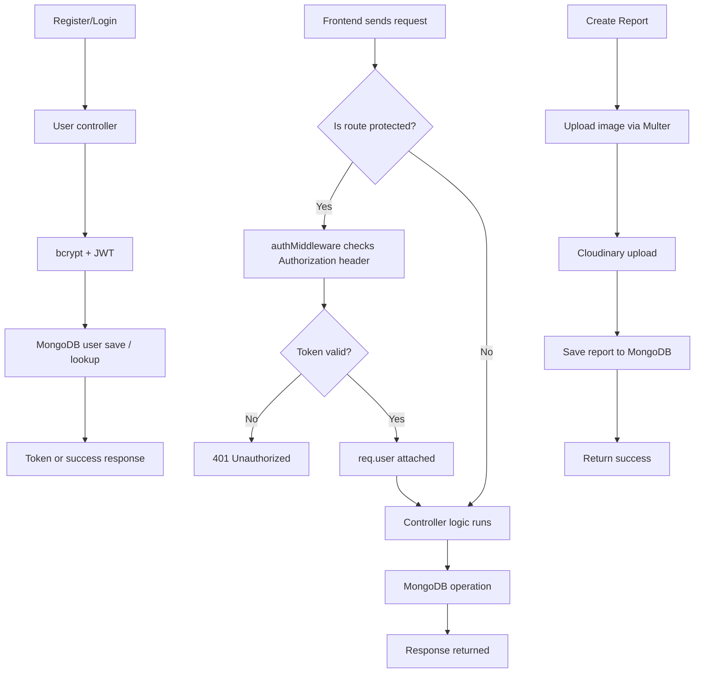

# Parisara Backend Notes

This is a beginner-friendly backend note set for the Parisara server. It explains the main flow, authentication, CRUD logic, and how the code is connected.

---

## 1) Project purpose

This backend is responsible for:
- user registration and login
- profile access for logged-in users
- report creation, listing, updating, and deletion
- image uploads for environmental reports
- database management with MongoDB

The app is mainly built with:
- Node.js
- Express.js
- MongoDB + Mongoose
- JWT for authentication
- bcrypt for password hashing
- Cloudinary for image storage
- Multer for temporary local file upload handling

---

## 2) Main startup file

The app starts from:
- server/server.js

What it does:
1. loads environment variables using dotenv
2. creates the Express app
3. uses cors
4. reads JSON from incoming requests
5. mounts user routes and report routes
6. connects to MongoDB
7. starts the server on a port

Important code idea:

```js
app.use("/api", userRouter);
app.use("/api/reports", reportRouter);
```

This means all user APIs are under `/api`, and all report APIs are under `/api/reports`.

---

## 3) Folder structure and purpose

### server/server.js
Main server entry point.

### server/routes/
Contains all endpoint URLs.

#### userRoutes.js
Routes for login, register, and profile:
- POST /api/register
- POST /api/login
- GET /api/me

#### report.routes.js
Routes for report CRUD:
- POST /api/reports/create-report
- GET /api/reports/get-reports
- GET /api/reports/get-reports/:id
- PATCH /api/reports/get-reports/:id
- DELETE /api/reports/get-reports/:id

### server/controllers/
Contains request logic.

#### userAuth.js
Handles:
- registerUser
- loginUser
- getProfile

#### reports.controllers.js
Handles:
- createReport
- getReports
- getReportById
- updateReport
- deleteReport

### server/models/
Contains MongoDB schemas.

#### user.models.js
User schema

#### report.model.js
Report schema

### server/middleware/
Contains request middleware.

#### authMiddleware.js
Verifies JWT tokens to secure routes.

#### cloudinary.middleware.js
Handles uploaded files using multer and saves them to local temp folder.

### server/utils/
Contains helper functions.

#### cloudinary.js
Uploads images to Cloudinary and deletes temp local files.

---

## 4) Authentication basics

### Why auth is needed
Your app has routes that should only work for logged-in users. For example:
- creating a report
- updating a report
- deleting a report
- viewing current user profile

A logged-in user is recognized using a JWT token.

### JWT flow
1. User sends email + password to login route
2. Server checks if email exists
3. Server compares password with hashed password using bcrypt
4. If passwords match, the server creates a JWT token
5. The token is returned to the frontend
6. The frontend sends the token in the `Authorization` header
7. Middleware verifies the token before letting the user access protected routes

Example header:

```http
Authorization: Bearer <jwt-token>
```

---

## 5) Register flow

Route:
- POST /api/register

Controller:
- registerUser in userAuth.js

Flow:
1. Get `name`, `username`, `email`, `password` from request body
2. Check required fields
3. Check password length is at least 8 characters
4. Check if email already exists
5. Hash password using bcrypt
6. Create a new user in MongoDB
7. Return success message and saved user data

Code idea:

```js
const hashedPassword = await bcrypt.hash(password, 10);

const newUser = await User.create({
  name,
  username,
  email,
  password: hashedPassword,
});
```

This is a secure way to store passwords.

---

## 6) Login flow

Route:
- POST /api/login

Controller:
- loginUser in userAuth.js

Flow:
1. Receive `email` and `password`
2. Check if both are provided
3. Find user by email
4. If not found, return error
5. Compare incoming password with stored hash
6. If valid, create JWT token
7. Return token and user details

Code idea:

```js
const isMatch = await bcrypt.compare(password, user.password);

const token = jwt.sign({ _id: user._id }, process.env.JWT_SECRET, {
  expiresIn: "7d",
});
```

This token is used for all protected API requests.

---

## 7) Protected route middleware

File:
- server/middleware/authMiddleware.js

This middleware verifies tokens.

Flow:
1. Read `Authorization` header
2. Confirm the header starts with `Bearer `
3. Extract token
4. Use `jwt.verify(token, process.env.JWT_SECRET)`
5. Attach decoded user info to `req.user`
6. Continue to the controller using `next()`

If invalid or missing, return 401.

Example:

```js
if (!authHead || !authHead.startsWith("Bearer ")) {
  return res.status(401).json({ message: "No token provided" });
}
```

This is the security layer used for editing/deleting reports and reading profile data.

---

## 8) Get profile flow

Route:
- GET /api/me

Controller:
- getProfile in userAuth.js

Flow:
1. Reads token from Authorization header
2. Verifies JWT
3. Finds user by decoded `_id`
4. Returns safe user information

This is how the frontend can fetch the current logged-in user from the server.

---

## 9) Report model explanation

File:
- server/models/report.model.js

This schema defines what a report object looks like in MongoDB.

Main fields:
- title: required string
- details: required string
- images: array of image URLs
- reportedBy: user who created the report
- category: enum such as pollution, waste, deforestation, water, other
- placename: required string
- status: reported, in-progress, resolved
- likes: array of user IDs
- comments: nested array of comments

This means each report is connected to a creator and supports content like images and comments.

---

## 10) Create report flow

Route:
- POST /api/reports/create-report

Controller:
- createReport in reports.controllers.js

Important steps:
1. Receive uploaded files from `req.files`
2. Upload each file to Cloudinary
3. Collect secure image URLs
4. Read `title`, `details`, `category`, `placename` from body
5. Validate required fields
6. Save report to MongoDB with `reportedBy: req.user._id`
7. Return success object

Code idea:

```js
const imageLocalPaths = req.files?.map((file) => file.path) || [];
const uploadImages = await Promise.all(
  imageLocalPaths.map((path) => uploadOnCloudinary(path))
);
```

Then:

```js
const result = await Report.create({
  title,
  details,
  category,
  placename,
  images: img_URL,
  reportedBy: req.user._id,
});
```

This is the main report creation logic.

---

## 11) Get all reports flow

Route:
- GET /api/reports/get-reports

Controller:
- getReports in reports.controllers.js

Flow:
1. Read optional query filters like `category` and `status`
2. Build a MongoDB filter
3. Query reports using `Report.find(filter)`
4. Populate user details for `reportedBy`
5. Sort by newest first
6. Return JSON response

Example filter logic:

```js
const { category, status } = req.query;
const filter = {};

if (category) filter.category = category;
if (status) filter.status = status;
```

This lets frontend fetch filtered report lists easily.

---

## 12) Get one report flow

Route:
- GET /api/reports/get-reports/:id

Controller:
- getReportById

Flow:
1. Read `id` from URL params
2. Find report by MongoDB ID
3. If not found, return 404
4. Return report data

This is used for report detail pages.

---

## 13) Update report flow

Route:
- PATCH /api/reports/get-reports/:id

Controller:
- updateReport

Flow:
1. Find the report by id
2. If not found, return 404
3. Check if logged-in user is the original reporter
4. Update allowed fields if present
5. If new images come in, upload them to Cloudinary
6. Save the report
7. Return updated data

Ownership check example:

```js
if (report.reportedBy?.toString() !== req.user._id.toString()) {
  return res.status(403).json({ message: "Not authorized to edit" });
}
```

This is a key security rule.

---

## 14) Delete report flow

Route:
- DELETE /api/reports/get-reports/:id

Controller:
- deleteReport

Flow:
1. Find report by id
2. Confirm it exists
3. Check if logged-in user created it
4. Delete the report
5. Return success message

This prevents other users from deleting someone else’s post.

---

## 15) Image upload system

### Why it is needed
Reports may contain photos, so the backend needs a safe way to upload and store images.

### Flow
1. Frontend sends files with multipart form data
2. Multer saves files to a temp folder
3. Controller uploads each file to Cloudinary
4. Cloudinary gives a secure URL
5. URL gets saved in MongoDB report document
6. Local temporary file is deleted

Upload logic lives in:
- server/middleware/cloudinary.middleware.js
- server/utils/cloudinary.js

This is a standard approach for storing images without keeping huge files directly in MongoDB.

---

## 16) User model explained

File:
- server/models/user.models.js

Fields:
- username
- name
- email
- password
- role

Important details:
- username is unique and lowercase
- email is unique and lowercase
- password is required
- `select: false` means password is not returned automatically in queries

This is important for security and for login logic.

---

## 17) Environment variables you need

Your app depends on some values from `.env`.

Typical values include:
- PORT
- MONGODB_URI
- JWT_SECRET
- CLOUDINARY_CLOUD_NAME
- CLOUDINARY_API_KEY
- CLOUDINARY_API_SECRET

Example:

```env
PORT=5000
MONGODB_URI=mongodb://localhost:27017/parisara
JWT_SECRET=your_secret_key
CLOUDINARY_CLOUD_NAME=your_cloud_name
CLOUDINARY_API_KEY=your_api_key
CLOUDINARY_API_SECRET=your_api_secret
```

Without these, the server cannot connect to database or Cloudinary.

---

## 18) Basic request flow diagram



---

## 19) Simple logic checklist for building a new feature

When adding a new API endpoint, follow this pattern:

1. Add route in route file
2. Create controller function
3. Validate request data
4. Use model to read/write MongoDB
5. Add auth middleware if needed
6. Return proper JSON response
7. Handle errors with try/catch

Example pattern:

```js
const someController = async (req, res) => {
  try {
    // validate
    // fetch or save data
    // respond
  } catch (error) {
    res.status(500).json({ message: "Server Error" });
  }
};
```

---

## 20) Final summary

Your backend is structured in a strong and standard way:
- routes manage URLs
- controllers manage logic
- models define database data
- middleware protects private routes
- Cloudinary handles images
- JWT + bcrypt handle authentication securely

The main features already present are:
- register
- login
- profile fetch
- create report
- list reports
- view single report
- update report
- delete report
- upload images

This is a complete CRUD + auth backend foundation.

---

## 21) Good next step for your learning

If you want to understand the code deeply, open files in this order:
1. server/server.js
2. server/routes/userRoutes.js
3. server/controllers/userAuth.js
4. server/middleware/authMiddleware.js
5. server/models/user.models.js
6. server/routes/report.routes.js
7. server/controllers/reports.controllers.js
8. server/models/report.model.js
9. server/middleware/cloudinary.middleware.js
10. server/utils/cloudinary.js

This order makes the backend flow easy to follow step by step.
