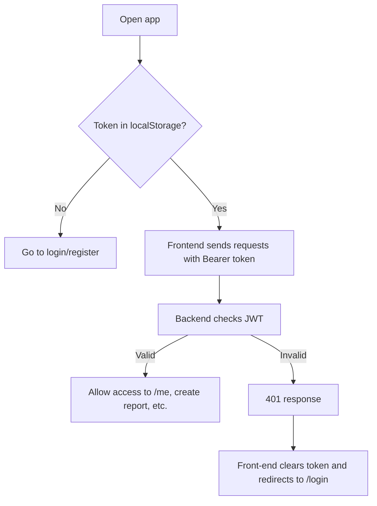
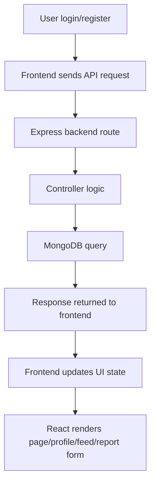

# Parisara Frontend Notes

This is a handwritten-style note for the client side of the Parisara app. It explains how the frontend connects to the backend and how the login/auth flow and CRUD actions work.

---

## 1) Frontend purpose

The frontend is responsible for:
- user registration
- user login
- showing profile info
- creating reports
- viewing reports in feed/profile
- sending protected requests with JWT token
- handling app routing

The client is built with:
- React
- Vite
- React Router
- Axios
- Tailwind CSS

---

## 2) Main app entry

The main app setup is in:
- client/src/App.jsx

This file contains route definitions:

- /login
- /register
- /me
- /feed
- /reports/create-report

Important logic:
- it renders Navbar except on /feed
- uses React Router Routes to switch pages

Example:

```jsx
<Route path="/login" element={<Login />} />
<Route path="/register" element={<Register />} />
<Route path="/me" element={<Profile />} />
<Route path="/feed" element={<Home />} />
<Route path="/reports/create-report" element={<CreateReport />} />
```

This is how the app navigates between the pages.

---

## 3) API setup

The central API layer is:
- client/src/services/api.js

This file creates a base Axios instance:

```js
const api = axios.create({
  baseURL: import.meta.env.VITE_API_URL,
});
```

So every request uses the backend base URL from the environment.

### Request interceptor
Every request automatically adds the JWT token to the Authorization header:

```js
api.interceptors.request.use((config) => {
  const token = localStorage.getItem("token");
  if (token) {
    config.headers.Authorization = `Bearer ${token}`;
  }
  return config;
});
```

This means when the user is signed in, the frontend attaches the token automatically to protected endpoints.

### Response interceptor
If the backend returns 401 unauthorized, the frontend removes the token and redirects to login.

```js
if (error.response?.status === 401) {
  localStorage.removeItem("token");
  window.location.href = "/login";
}
```

This is a global logout behavior.

---

## 4) Login flow in frontend

File:
- client/src/pages/Login.jsx

The login page does this:
1. collects email and password
2. calls `api.post("/login", { email, password })`
3. stores the returned token in localStorage
4. displays success alert
5. navigates to /me

Important part:

```js
const res = await api.post("/login", {
  email,
  password,
});

localStorage.setItem("token", res.data.token);
```

This token is used later for protected API calls.

### Flow

```mermaid
flowchart TD
    A[User types email + password] --> B[Submit form]
    B --> C[api.post('/login')]
    C --> D[Backend validates user]
    D --> E{Login success?}
    E -- Yes --> F[Save token in localStorage]
    F --> G[Redirect to /me]
    E -- No --> H[Show error alert]
```

---

## 5) Register flow

File:
- client/src/pages/Register.jsx

The register page:
1. collects name, username, email, password
2. sends POST request to `/register`
3. if success, alerts the user and redirects to login page

Code idea:

```js
await api.post("/register", {
  name,
  username,
  email,
  password,
});

navigate("/login");
```

This is the frontend side of the user registration process.

---

## 6) Profile page flow

File:
- client/src/pages/Profile.jsx

This page checks whether a token exists before loading user data.

If no token exists:

```js
if (!token) {
  navigate("/login");
  return;
}
```

Then it loads two things in parallel:
- current user profile from `/me`
- all reports from `/reports/get-reports`

```js
const [profileResponse, reportsResponse] = await Promise.all([
  api.get("/me"),
  api.get("/reports/get-reports"),
]);
```

Then it filters the reports to show only the current user’s own posts.

```js
const ownReports = mappedReports.filter((report) => report.authorId === userData._id);
```

This page is basically the “my profile / my reports” screen.

---

## 7) Navbar and protected navigation

File:
- client/src/components/Navbar.jsx

This component checks:

```js
const isAuthenticated = localStorage.getItem("token");
```

If token exists:
- show dashboard navigation links
- show Profile, Feed, Create report
- show logout button

If token does not exist:
- show Sign in and Sign up

Logout simply removes the token and sends user to login.

```js
localStorage.removeItem("token");
navigate("/login");
```

This is how the frontend keeps auth state in the browser.

---

## 8) Create report flow

File:
- client/src/pages/CreateReport.jsx

This is the main report form page.

### What it does
1. creates a formData object for title, details, placename, category
2. allows selecting 1 to 3 images
3. previews the uploaded images using object URLs
4. submits a FormData request to `/reports/create-report`
5. redirects to /me on success

Important part:

```js
const payload = new FormData();
Object.entries(formData).forEach(([name, value]) => {
  payload.append(name, value);
});

images.forEach((image) => payload.append("images", image));

await api.post("/reports/create-report", payload);
```

This is how the client sends files, not plain JSON, because the server expects uploaded file data.

### Flow

```mermaid
flowchart TD
    A[User fills report form] --> B[Select category + location + description]
    B --> C[Choose image(s)]
    C --> D[Create FormData payload]
    D --> E[api.post('/reports/create-report', payload)]
    E --> F[Backend validates and uploads to Cloudinary]
    F --> G{Success?}
    G -- Yes --> H[Redirect to /me]
    G -- No --> I[Show error message]
```

---

## 9) Feed / list reports flow

The frontend fetches reports from the backend using:

```js
api.get("/reports/get-reports")
```

The profile page and feed page both rely on this route.

Data returned from backend is usually:
- report title
- details
- category
- placename
- images
- author info
- comments
- status

Then frontend maps this API response into a UI-friendly format before rendering cards.

---

## 10) Role of localStorage

The frontend stores auth state in localStorage:

```js
localStorage.setItem("token", res.data.token);
```

This is used for:
- checking if user is logged in
- attaching the token to requests
- showing protected UI elements
- log out behavior

This is an important frontend security pattern, but the actual security is still enforced by the backend JWT validation.

---

## 11) Full frontend auth flow



---

## 12) Frontend + backend combined flow



This is the end-to-end architecture of the app.

---

## 13) Important frontend understanding

The user interface is not doing the real security work. The real validation happens on the backend.

So frontend does this:
- collects input
- sends request
- stores token
- renders data

Backend does this:
- validates login
- verifies token
- checks ownership
- protects APIs
- saves data

This is how a proper full-stack app is usually structured.

---

## 14) Main frontend files to remember

- client/src/App.jsx → route setup
- client/src/services/api.js → axios config + auth header
- client/src/pages/Login.jsx → login form
- client/src/pages/Register.jsx → signup form
- client/src/pages/Profile.jsx → logged-in user profile and reports
- client/src/pages/CreateReport.jsx → create report form
- client/src/components/Navbar.jsx → nav + logout

---

## 15) Very short summary

Frontend flow is simple:
- user signs in
- token saved in localStorage
- every request includes token automatically
- protected backend routes validate it
- frontend shows data from backend responses
- report creation sends form-data with images

This is the client-side flow behind your whole app.
